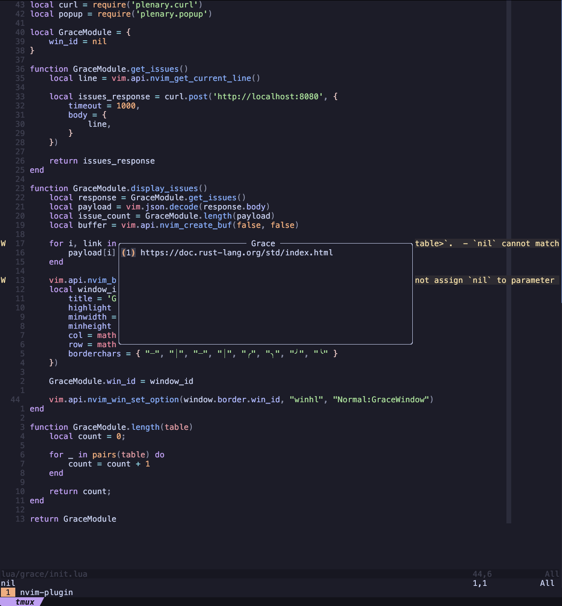

### Grace

Essentially the mission of this project is to provide a better search experience for developers. I 
believe that a common problem that many developers face is having to context switch between writing 
code and searching for documentation. In our current day and age these are two seperate skills, one 
involves writing code, the other involves knowing how to find documentation or how to craft a 
Google query with the correct context that provides resources that solve your problem. I believe 
that we can simplify this process. 

Grace is essentially a search engine that allows users to search for documentation and other 
resources from within the editor using the code in the current editing buffer. Grace will take the 
current language and the code in the buffer to query the internet via code instead of via english. 
I believe that allowing developers, both junior and senior, to find information via code will
remove a significant barrier to improving a software engineer as learning to search would be based
around the code we are writing and the context it is written in.

At a high level I believe that this is an area where LLM's would excel as I believe they are much
better at reading code than they are at writing code. Since LLM's are essentially excellent at 
learning patterns and predicting what comes next they can produce queries for knowledge that
would take us a bit of iterating through Google to find the right GitHub issue, documentation
section, or even StackOverflow answer. Even if they do not yield the correct resource, it covers
many of the starting places developers would go to when searching for answers to their problems.

That high level description of Grace, while interesting is entirely a hypothesis. To test this 
hypothesis the best thing to do is create a very simplified approach to test if the idea itself
has any merit before attempting to engineer a solution that involves AI/ML at scale while indexing
the entirity of the internet in the same way that Google does.

To test this idea, I have defined the MVP as follows.
- Users can install an nvim plugin
- Users can enter visual mode and select some code to search for resources for
- The plugin will then provide a floating window containing the links to each resource

Some implementation notes are defined here
- To search for code an api with a search endpoint will be called
- This endpoint will search by looking for any function calls in the visual selection and checking
the index for these function calls
- The index will be a mapping from names of functions to a list of document ids
- The index will draw these names of functions by parsing webpages that it crawls
- The crawler will not exist at first, instead we will manully populate the index with nvim docs
- To start this project will only work for the Lua programming language and focus on nvim plugin
development.

## Images

## Progress
Currently the nvim plugin is working and an API exists and can search for code, however, the
current search algorithm does not produce great results so at the moment the tool is quite
unhelpful. To reach the MVP of this project some work needs to be done finding the simplest way
to improve the search so that I can test my hypothesis.

## Why Lua and nvim?

Lua is a very simple language so parsing documents that contain lua seems relatively straight
forward and building an nvim plugin requires a lit bit of domain knowledge + reading the docs.
Many people turn towards videos and articles to follow when attempting to build plugins and I feel
that Grace could help prevent people from entering "Tutorial Hell" by providing help in editor,
which encourage developers to experiment and iterate within their editor instead of constantly
reading half baked articles. 

## Example UI

Here is an example of the UI in nvim.
